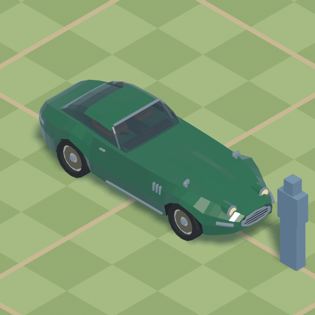

# agent-skills

Skills for coding agents. Each one packages a **working toolkit and the method
for using it** — not just a prompt.

| | | | |
|:--:|:--:|:--:|:--:|
|  |  |  |  |

<sub>Each of these was built by an agent from a one-paragraph brief, using
`blender-model` and nothing else.</sub>

```
/plugin marketplace add AlexConnolly/agent-skills
/plugin install blender-model@connolly-skills
```

---

## The skills

| | Skill | What it does | Needs |
|:--:|---|---|---|
| 🗼 | **[blender-model](plugins/blender-model/)** | Builds 3D models in Blender as parametric Python, working a build → render → look → fix loop against a rendered contact sheet | Blender 4.x/5.x |

<details>
<summary><b>🗼 blender-model</b> — details, and what it deliberately cannot do</summary>

<br>

Models are authored as parametric Python that exports to glTF, and the agent
works a **build → render → look → fix** loop against a rendered contact sheet
instead of writing geometry blind. That loop is the whole point: geometry can
be completely wrong in a way that is invisible in the source, and the only
thing that catches it is a picture.

Build scripts for the four models above are in
[`examples/`](plugins/blender-model/skills/blender-model/examples/) — primitives
plus a grown `Form`, a node hierarchy with separately named wheels, a lofted
hull, and a body whose section changes at every station.

### The contact sheet

Fourteen renders per model: the app's own camera at four headings, three
orthographics, a flat-black silhouette that strips away everything you could
hide behind, and the same shot rendered at the real pixel size the object is
seen at.


A second agent then reviews the result from the pictures and the brief, and is
forbidden from reading the build script — a builder that has written a function
called `wheelhouse()` perceives a wheelhouse, and only someone who has not seen
the code is free of that.

### What's in it

`Form` — one mesh grown from a cube: extrude, inset, loop cut, bevel, taper,
bend, warp, mirror. Swept forms — `loft`, `profile` with per-station taper,
`revolve`. Booleans — `cut`, `fuse`, `intersect`, `hole`. Primitives, materials
with correct sRGB→linear conversion, node hierarchies for animated parts, and
glTF export with a triangle and ground-contact report.

**Needs** [Blender](https://www.blender.org/download/) 4.x or 5.x on `PATH`.
No Python packages — everything runs inside Blender's bundled interpreter.

### What it is not

**Not a photoreal pipeline.** Every surface is one flat PBR colour. There are
no UVs, no textures, no normal or roughness maps, no vertex colours, no scatter
or particle system, no displacement modifier, and the contact sheet is lit by a
single sun rather than an HDRI.

That is a hard ceiling on *surface* realism: leather, rust, moss, wood grain,
dirt and wear are surface qualities, and this toolkit has no concept of a
surface beyond its colour.

What it is good at is **form** — hard-surface, architectural, modular,
parametric geometry. Game props, vehicles, buildings, scenery, and blockouts to
take into a texturing pipeline. Irregularity and decay can be expressed
*geometrically* through `Form.warp()` — a slumped wall line, crenellations
eroded to uneven stumps — but not as weathering on a surface.

→ [Full documentation](plugins/blender-model/) ·
[API reference](plugins/blender-model/skills/blender-model/reference.md)

</details>

---

## Installing

The two lines at the top are the short version. Everything else:

<details>
<summary>Copying a skill in by hand, without the plugin machinery</summary>

<br>

```bash
git clone https://github.com/AlexConnolly/agent-skills.git

# personal — available in every project
mkdir -p ~/.claude/skills ~/.claude/agents
cp -r agent-skills/plugins/blender-model/skills/blender-model ~/.claude/skills/
cp agent-skills/plugins/blender-model/agents/*.md ~/.claude/agents/
```

For a **single project** instead, so it is committed with the repo and your
team gets it:

```bash
mkdir -p .claude/skills .claude/agents
cp -r agent-skills/plugins/blender-model/skills/blender-model .claude/skills/
cp agent-skills/plugins/blender-model/agents/*.md .claude/agents/
```

Claude Code watches both directories, so a skill dropped in is live in the
current session without a restart. Note that the plugin route installs the
sub-agents for you; by hand you have to copy them yourself, and the skill does
not work without them.

</details>

<details>
<summary>Using these with agents other than Claude Code</summary>

<br>

`SKILL.md` is plain markdown with YAML frontmatter, and the toolkit is plain
Python that only imports Blender's own modules. Point your agent at `SKILL.md`
and `reference.md` as context, and give it a shell that can run
`blender --background --python`. The agent definitions in `agents/` are also
plain markdown and translate to most sub-agent systems.

</details>

<details>
<summary>Updating, and checking what is loaded</summary>

<br>

```
/plugin marketplace update connolly-skills   # pull new versions
/skills                                      # list what is loaded
/plugin                                      # manage installed plugins
```

</details>

---

## Contributing

<details>
<summary>Repository layout</summary>

<br>

```
agent-skills/
├── .claude-plugin/
│   └── marketplace.json          the marketplace manifest
├── tests/
│   └── test_toolkit.py           blender --background --python tests/test_toolkit.py
└── plugins/
    └── blender-model/
        ├── .claude-plugin/plugin.json
        ├── agents/
        │   ├── model-smith.md    builds the model
        │   └── model-critic.md   reviews it without seeing the code
        └── skills/blender-model/
            ├── SKILL.md          what the agent loads
            ├── reference.md      the API
            ├── scripts/          the toolkit itself
            ├── examples/         the models above, as build scripts
            └── images/
```

</details>

<details>
<summary>Adding a skill</summary>

<br>

1. `plugins/<name>/skills/<name>/SKILL.md`, with `name` and `description`
   frontmatter. The description is what the agent reads to decide whether the
   skill is relevant, so write it as a trigger, not a title.
2. Anything else it needs alongside it — `scripts/`, `reference.md`, `agents/`.
3. Add an entry to `.claude-plugin/marketplace.json`.
4. Add a row to the skills table above, and a `<details>` block under it.
5. `claude plugin validate .` before opening a PR.

Keep `SKILL.md` under about 500 lines and move detail into supporting files —
the frontmatter description is always in context, but the body is only loaded
when the skill fires.

</details>

<details>
<summary>Tests</summary>

<br>

```bash
blender --background --python tests/test_toolkit.py
```

Every assertion corresponds to a fault that actually shipped and was caught by
looking at a render — a loop cut that flattened a mesh onto the cut plane, a
silhouette pass that destroyed per-face materials for every shot after it,
bounds measured through a rotation. The point of the file is that the next one
gets caught in two seconds instead.

</details>

## Licence

MIT. See [LICENSE](LICENSE).
