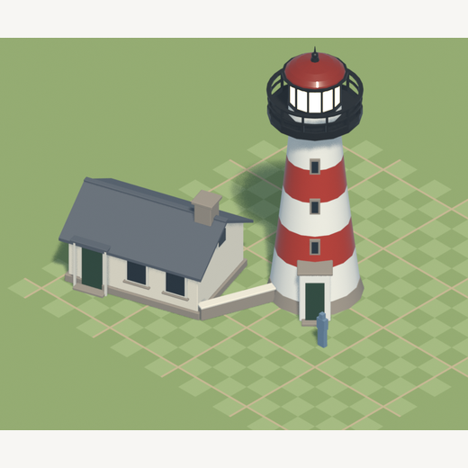
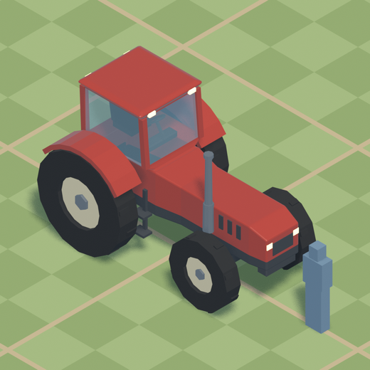
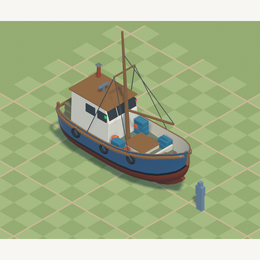
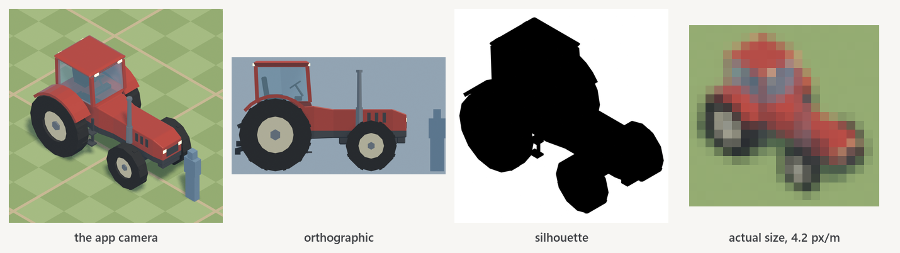

# agent-skills

Skills for coding agents. Each one packages a **working toolkit and the method
for using it** — not just a prompt.

A skill here is a directory containing a `SKILL.md` that the agent loads when
the work matches, plus whatever that work actually needs: library code, a
sub-agent definition, a reference doc. They are written for
[Claude Code](https://code.claude.com/docs/en/skills), and the plain-markdown
ones work in anything that reads
[Agent Skills](https://code.claude.com/docs/en/skills).

---

## The skills

### 🗼 blender-model

**Teaches an agent to build 3D models in Blender.**

Models are authored as parametric Python that exports to glTF, and the agent
works a **build → render → look → fix** loop against a rendered contact sheet
instead of writing geometry blind. That loop is the whole point: geometry can
be completely wrong in a way that is invisible in the source, and the only
thing that catches it is a picture.

Every model below was built by an agent from a one-paragraph brief, using this
skill and nothing else.

| | | |
|:--:|:--:|:--:|
|  |  |  |
| primitives + a grown form | hierarchy, named nodes | a lofted hull |

The contact sheet is what makes it work. Fourteen renders per model: the app's
own camera at four headings, three orthographics, a flat-black silhouette that
strips away everything you could hide behind, and the same shot rendered at the
real pixel size the object is seen at.



**What's in it:** `Form` (one mesh grown from a cube — extrude, inset, loop
cut, bevel, taper, warp, mirror), swept forms (`loft`, `profile`), primitives,
materials with correct sRGB→linear conversion, node hierarchies for animated
parts, glTF export with a triangle and ground-contact report, and the contact
sheet renderer.

**Needs:** [Blender](https://www.blender.org/download/) 4.x or 5.x on `PATH`.
No Python packages — everything runs inside Blender's bundled interpreter.

→ [Full documentation](plugins/blender-model/) · [API reference](plugins/blender-model/skills/blender-model/reference.md)

---

## Installing

### Option 1 — as a plugin (recommended)

Adds the skill *and* its sub-agent, and keeps them updatable. In Claude Code:

```
/plugin marketplace add AlexConnolly/agent-skills
/plugin install blender-model@connolly-skills
```

Then use it by name:

```
/blender-model build me a windmill, waist-high to a man at the door
```

To update later:

```
/plugin marketplace update connolly-skills
```

### Option 2 — copy the skill in by hand

No plugin machinery, but you have to copy the agent separately.

```bash
git clone https://github.com/AlexConnolly/agent-skills.git

# personal — available in every project
mkdir -p ~/.claude/skills
cp -r agent-skills/plugins/blender-model/skills/blender-model ~/.claude/skills/

# the sub-agent it delegates to
mkdir -p ~/.claude/agents
cp agent-skills/plugins/blender-model/agents/model-smith.md ~/.claude/agents/
```

For a **single project** instead, so it is committed with the repo and your
team gets it:

```bash
mkdir -p .claude/skills .claude/agents
cp -r agent-skills/plugins/blender-model/skills/blender-model .claude/skills/
cp agent-skills/plugins/blender-model/agents/model-smith.md .claude/agents/
```

Claude Code watches both directories, so a skill dropped in is live in the
current session without a restart.

### Option 3 — other agents

`SKILL.md` is plain markdown with YAML frontmatter, and the toolkit is plain
Python that only imports Blender's own modules. To use it elsewhere, point your
agent at `SKILL.md` and `reference.md` as context and give it a shell that can
run `blender --background --python`.

### Checking it worked

```
/skills
```

lists what is loaded. `/plugin` manages installed plugins.

---

## Repository layout

```
agent-skills/
├── .claude-plugin/
│   └── marketplace.json          the marketplace manifest
└── plugins/
    └── blender-model/
        ├── .claude-plugin/plugin.json
        ├── agents/
        │   └── model-smith.md    the sub-agent that does the work
        └── skills/blender-model/
            ├── SKILL.md          what the agent loads
            ├── reference.md      the API
            ├── scripts/          the toolkit itself
            └── images/
```

## Adding a skill

1. `plugins/<name>/skills/<name>/SKILL.md`, with `name` and `description`
   frontmatter. The description is what the agent reads to decide whether the
   skill is relevant, so write it as a trigger, not a title.
2. Anything else it needs alongside it — `scripts/`, `reference.md`,
   `agents/`.
3. Add an entry to `.claude-plugin/marketplace.json`.
4. Add a section to this README, with a picture.
5. `claude plugin validate .` before opening a PR.

Keep `SKILL.md` under about 500 lines and move detail into supporting files —
the frontmatter description is always in context, but the body is only loaded
when the skill fires.

## Licence

MIT. See [LICENSE](LICENSE).
