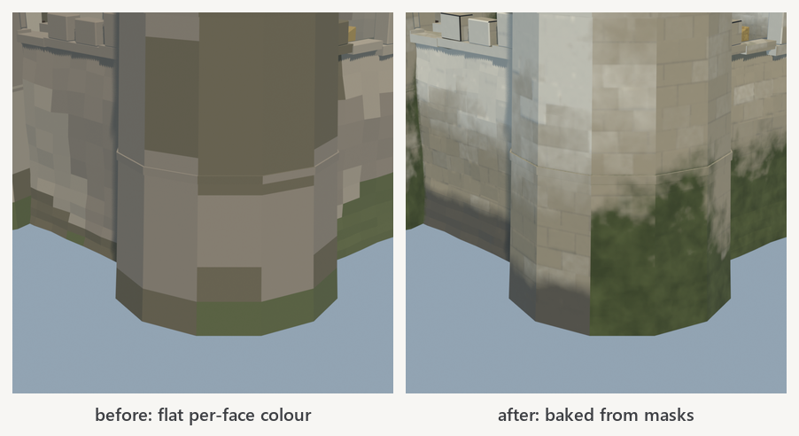
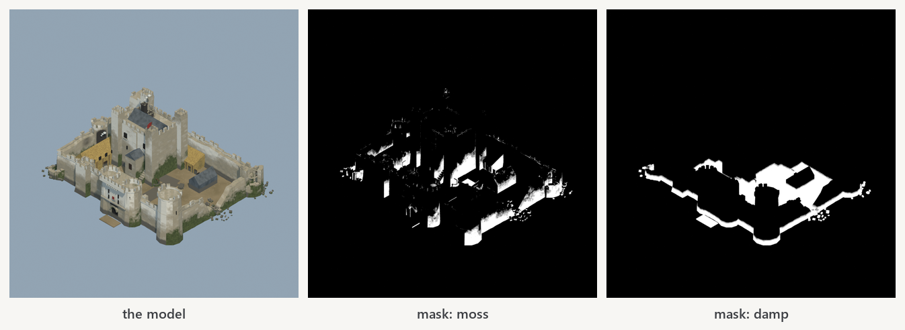
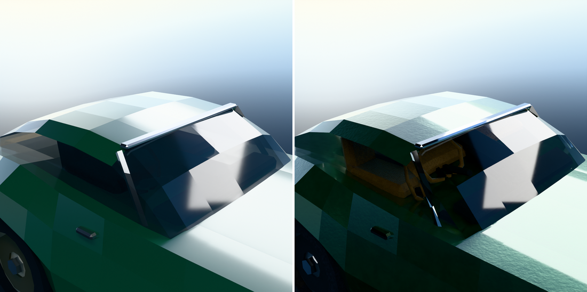

# blender-texture

Teaches an agent to **skin** a 3D model: procedural materials built from
placement masks, baked down to real glTF textures, working a
**bake → render → look → fix** loop.

Companion to [`blender-model`](../blender-model/), which makes the shape. Either
works alone; together they are a pipeline.



The same corner of the same castle, same camera. On the left, flat per-face
colour — the moss is a band of discrete quads and there is a lone pale
rectangle mid-wall. On the right, baked from masks. As the castle's own builder
put it before this existed: *"a lone green quad mid-wall is a tile, never a
plant."*

## The pipeline, and why it has to be this shape

glTF carries image textures wired into a Principled BSDF. **It does not carry
procedural nodes.** A noise-and-ramp material renders beautifully in Blender and
arrives in the engine as flat grey — a failure you only find after export unless
you know to expect it.

So: build procedurally → unwrap → **bake to images** → rewire → export. The bake
is not an optimisation, it is the only way the material leaves Blender.
`export()` prints the embedded image count so a silent failure cannot ship.

## Masks are the whole game

A material is a base surface plus things sitting on it **in particular places**
— moss low down and on the shaded side, rust around fixings, dirt in crevices,
wear on handled edges. Those placements are what make a surface read as
weathered rather than tinted, and every one is a mask.

| Mask | Reaches for |
|---|---|
| `mask_height(lo, hi)` | What gravity and weather decide — damp plinths, tide marks, snow |
| `mask_facing(dir)` | The shaded or weather side. Moss goes north |
| `mask_cavity(dist)` | Inside corners. **The one that works on flat-faced low-poly** |
| `mask_curvature()` | Concave creases — needs real curvature, gives nothing on flat faces |
| `mask_edges(r)` | Exposed corners: rubbed paint, polished metal |
| `mask_cells(cell)` | A different random value per grid cell: brick, tile, planks, scales |
| `mask_courses(...)` | Coursed masonry — the joints, and a per-block tone |
| `mask_noise(stretch=)` | Anisotropic. Almost every real stain runs downward |

Combine with `mul` (intersection), `fmax` (union), `remap` and `ramp(gamma=)`.
Reach for `fmax` more than you expect: multiplying four independent 0–1 fields
averages **0.06**, which is the classic "nothing happens" first pass.

## The two shots that decide things



**Mask views.** Each placement rendered on its own, in grey, white where it is
strong — with a coverage number. Modelling has the flat-black silhouette; this
is its equivalent, because *"the moss is wrong"* is not actionable and *"the
moss mask covers the whole south wall instead of the bottom two metres"* is.
Nine times out of ten the surface is fine and the placement is not.

**Raking light.** Under flat front light a painted-on suggestion of texture and
real relief look identical. Under a light skimming the surface they do not.

## Sizing follows from the object

`bake_set(obj, name, size='auto')` measures texel density after unwrapping and
picks the map size that reaches `TARGET_PX_PER_M`. When it cannot reach it even
at the cap it says so, and works out how many modules the object needs instead:

```
TEXELS castle               115.4 px/m at 4096  (target 256)
       OVER BUDGET. 115.4 px/m against a target of 256, and 4096 is the cap.
       This object is 35.5 m across. At 256 px/m one map covers about 16.0 m,
       so it needs roughly 5 modules rather than more effort on this one.
```

One object gets one UV square, so `MAX_BAKE_SIZE / TARGET_PX_PER_M` is the
largest object that can ever reach a given fidelity. Past it the answer is
modular geometry, not more texturing.

## Metal needs something to reflect



A polished surface shows you its surroundings and nothing else, so against a
flat sky colour chrome renders as grey card whatever the material says. Set
`STUDIO_ENV = True` for a gradient world, a dark floor and black flags.

Measured on a car whose chrome would not read: a gradient sky changed almost
nothing (*"a gradient is one smooth value, and a flat-faced bumper takes exactly
one sample of it per facet"*), a banded sky did nothing either because at the
strength needed to light the car the sky already clips. **Black flags did it.**
What chrome was missing was not brightness, it was dark.

If you change the rig, re-render the baseline under it — otherwise the
before/after measures your lighting, not your material.

## Install

```
/plugin marketplace add AlexConnolly/agent-skills
/plugin install blender-texture@connolly-skills
```

**Requires** [Blender](https://www.blender.org/download/) 4.x or 5.x. Baking
uses Cycles, which ships with it. A six-material bake at 2048 takes minutes, not
hours.

## Worked examples

- [`skin_castle.py`](skills/blender-texture/examples/skin_castle.py) — limestone,
  damp, moss, lichen, bleach and soot. Eight passes.
- [`skin_sports_car.py`](skills/blender-texture/examples/skin_sports_car.py) —
  the opposite problem: *"a claim about manufacture, and the whole difficulty is
  that an expensive surface has almost no variation, so the little it has has to
  be right."* Metallic flake under clearcoat, chrome, transmissive glass, leather.

## What this cannot do

No image-based source textures — everything is procedural or baked from
procedural. No hand-painting, no photo scans, no decals. Displacement is fake:
bump and normal maps only, so a silhouette stays as smooth as it was modelled.
And a mask cannot find geometry that is not there — panel shut lines on a body
modelled flush measure 0.0% at every cavity distance, because there is no
concavity to find.
